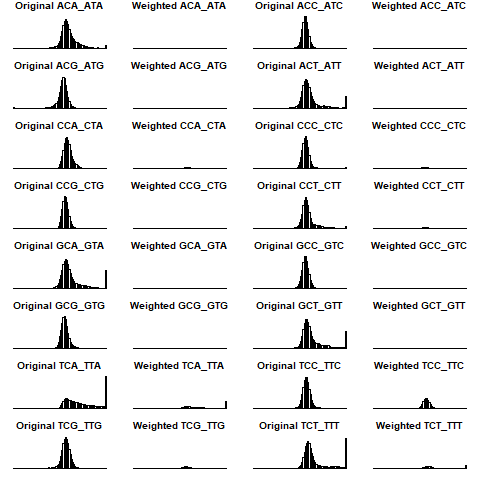

```{r setup, include=FALSE}
knitr::opts_chunk$set(echo = TRUE)
```

## Example of Signature-QBiC for HOXD13 and mutational signature SBS7a

This is the example shown in Figure 1b of Liu et al., Mutational Processes in 
Cancer Preferentially Affect Binding of Particular Transcription Factors.

### Load libraries

Note: you will need to install the github package PCAWG7 if not already 
installed. This contains the mutational signature profiles.

```{r, eval=FALSE}
remotes::install_github("steverozen/PCAWG7")
```

```{r libs}
library(PCAWG7)
library(tibble)
```

### Get information on mutational signatures

```{r sig_inputs}
PCAWG_subs_signature <- PCAWG7::signature$genome$SBS96

mut.types <- lapply(row.names(PCAWG_subs_signature),function(x){
  return(paste(substring(x,1,3),
               paste(substring(x,1,1),
                     substring(x,4,4),
                     substring(x,3,3),sep=""),
               sep="_"))
})
mut.types <- row.names(PCAWG_subs_signature) <- unlist(mut.types)

## We used SBS7a as an example
signature <- "SBS7a" 
sig <- PCAWG_subs_signature[ , signature, drop = FALSE]
```

### Gather the QBiC (protein binding microarray) information

We downloaded the QBiC scores table and p value table from
http://qbic.genome.duke.edu/downloads.
The data are distributed across multiple files.
For this example we used the "part-3" link
to get the file 'prediction_3.zip'.
We changed '|' characters in the file names to '!' to avoid
problems on MS Windows.

```{r QBiC_inputs}
QBiC_score_file_path <-
  "../data-raw/prediction6mer.Homo_sapiens!M01252_1.94d!Barrera2016!HOXD13_I322L_R1.txt.gz"
QBiC_scores_table <- 
  data.table::fread(QBiC_score_file_path, stringsAsFactors = F, fill = T)
# This gives a data frame with columns diff and z_score
# QBiC_scores_table contains NA for non-mutations, e.g AAAAAAAAAAA -> AAAAAAAAAAA

pvalue_file_path <- 
  "../data-raw/pval6mer.Homo_sapiens!M01252_1.94d!Barrera2016!HOXD13_I322L_R1.csv.gz"
pvalue <- scan(pvalue_file_path)
# pvalue also contains NA for non-mutations
pvalue <- pvalue[!is.na(pvalue)]

all.possible.twelvemers <- 
  tibble(readRDS("../data-raw/all.possible.twelvemers.rds")) 
QBiC_score_info <- 
  tibble(QBiC_mut = all.possible.twelvemers$seq, 
         mut_type = all.possible.twelvemers$final_signature, 
         scores   = QBiC_scores_table$z_score[!is.na(QBiC_scores_table$z_score)],
         p        = pvalue,
         q        = p.adjust(pvalue, method = "BH"))
rm(pvalue_file_path, QBiC_scores_table, QBiC_score_file_path)
```

# Plotting function for Figure 1

This function plots the distributions 
of QBiC scores assuming all mutations occur at equal
frequencies and assuming mutations occur at frequencies
in a particular mutational signature. See main text
Figure 1c,e.7

```{r}
TruncatedHist <- function(all.QBiC.scores,original.scores,weighted.prop,mutation.type){
  cut_off <- quantile(all.QBiC.scores,seq(0,1,0.01))[100] ##pile the 1% tail up
  original.scores[original.scores>cut_off] <- cut_off
  original.scores[original.scores<(-cut_off)] <- (-cut_off)
  weighted.hist <- original.hist <- hist(original.scores, breaks = seq(-(cut_off+0.5),
                                                                       (cut_off+0.5),0.5), plot=F)
  weighted.hist$density <-  weighted.hist$density*weighted.prop
  plot(original.hist,freq = F,ylim=c(0,max(original.hist$density)+0.05),
       main=paste0("Original ",mutation.type),xaxt="n",yaxt="n")
  plot(weighted.hist,freq=F,ylim = c(0,max(original.hist$density)+0.05),
       main=paste0("Weighted ",mutation.type),xaxt="n",yaxt="n")
}
```


### The SignatureQBiC function.

This function can also be found in SigQBiC package.
In the SigQBiC package, 
SignatureQBiC function returns Gain Ratio and Loss Ratio with the given 
QBiC scores, pvalues and signature. 
For tutorial purpose, here we split
SignatureQBiC into several chunks to show how 
we calculate Gain Ratio and Loss Ratio.


```{r SignatureQBiC_function}

SignatureQBiCExample <- function(QBiC_score_info,
                                 sig, 
                                 plot.path = NULL) {
  
  max.score <- as.integer(max(QBiC_score_info$scores)) + 2
  # Guaranteed that the QBiC scores' distribution will be symmetric
  
  summary <-data.frame(matrix(ncol=5,nrow=0))
  my.breaks <- seq(-max.score,max.score,0.001)
  
  if(!is.null(plot.path)){
    all.weighted.freq <- 0
    if (!dir.exists(plot.path)) {
      if (!dir.create(plot.path, recursive = T))
        stop("Cannot create plotting directory ", plot.path)
    }
    png(filename = paste0(plot.path, "/", "hist%03d.png"))
    par(mar = c(1,1,1,1))
    par(mfrow = c(8,4))
  }
  
  for (mutation.type in mut.types) { 
    stopifnot(mutation.type %in% QBiC_score_info$mut_type)
    # Scores for the given mutation.type    
    tmp.scores <- 
      QBiC_score_info$scores[QBiC_score_info$mut_type==mutation.type] ##the scores were put into bins
    
    dist.hist <- hist(tmp.scores, breaks = my.breaks, plot=F)
    w.dist.hist <- dist.hist
    w.dist.hist$counts <- dist.hist$counts * sig[mutation.type, ]
    
    partial.summary <- 
      data.frame(scores         = dist.hist$mids,
                 frequency      = dist.hist$counts,
                 mut_type       = mutation.type,
                 signature_freq = sig[mutation.type, ],
                 weighted.freq  = dist.hist$counts * sig[mutation.type, ])
    ##multiply the counts of each bin by the frequency of mutations in a signature
    
    if(!is.null(plot.path)){
      #collect 'weighted.freq' for each mutation type for the whole distribution plotting
      all.weighted.freq <- all.weighted.freq + dist.hist$counts * sig[mutation.type, ]
      TruncatedHist(QBiC_score_info$scores,
                    original.scores = tmp.scores, 
                    weighted.prop = sig[mutation.type, ],
                    mutation.type=mutation.type)
    }
    summary <- rbind(summary, partial.summary)
  }
  if(!is.null(plot.path)){
    all.scores <-  QBiC_score_info$scores
    cut_off <- quantile(all.scores,seq(0,1,0.01))[100] ##pile the 1% tail up
    weighted.hist <- original.hist <- hist(all.scores, breaks = my.breaks, plot=F)
    weighted.hist$counts <-  
      all.weighted.freq*sum(original.hist$counts)/sum(all.weighted.freq)
    plot(original.hist,main = "Original Distribution")
    plot(weighted.hist,main = "Weighted Distribution")
    dev.off()
  }
  
  return(summary)
}
```

Run SignatureQBiC.

```{r Run_SignatureQBiC}
if (file.exists("ss.rds")) {
  summaryofscores <- readRDS("ss.rds")
} else {
  summaryofscores <- 
    SignatureQBiCExample(QBiC_score_info = QBiC_score_info,
                         sig = sig, 
                         plot.path = "./png.dir") 
  saveRDS(summaryofscores, "ss.rds")
}
```

### Example of part of plotting output from SignatureQBicExample

This figure shows the distributions of QBiC scores for mutations centered at C>T
For each histogram, the vertical axis indicates the density, and 
horizontal axis indicates the QBiC scores. The 'weighted TCA_TTA' plot
in the first column, second plot from the bottom) shows an
example of the case in which that particular mutation (TCA to TTA)
is expected to generate many mutations with high QBiC scores
(high bar at the far right of the plot).

```{r Example_figure}

```


### Find the p-value cutoff for $D_{Pos}$ and $D_{Neg}$

We first show the example for $D_{Pos}$.

```{r, Processing data}
pos.sig.QBiC_score_info <- 
  QBiC_score_info[QBiC_score_info$q < 0.1 & QBiC_score_info$scores>0,] #select Dpos

##get the cutoff of QBiC scores based on BH FDR (indicated as T in paper)
qvalue.cutoff.score <- min(pos.sig.QBiC_score_info$scores)

# Normalize the weighted frequencies. After multiplying with signature
# probability, the weighted frequency is 96 times less than the original
# frequency. sum(freq) = 96*sum(weighted.freq)
summaryofscores$weighted.freq <- 
  summaryofscores$weighted.freq * 
  sum(summaryofscores$frequency)/sum(summaryofscores$weighted.freq)
```

Select $D'_{Pos}$ ($D'_{Neg}$) and $D_{Pos}$ ($D_{Neg}$) to calculate GR and LR
This part is included in SigQBiC::SignatureQBiC. We show this part separately for 
tutorial purpose.
Generate Dpos and D'pos based on T, and calculate Gain Ratio (GR).
GR > 1 stands for area(D'pos) > area(Dpos)

### Compute $D'_{Pos}$ and the Gain Ratio, GR

```{r Generate_Gain_Ratio}
summaryofscores.Dpos <- 
  summaryofscores[summaryofscores$scores>qvalue.cutoff.score, ] ##Select Dpos 

Dpos <- rep(summaryofscores.Dpos$scores, 
            summaryofscores.Dpos$frequency) #Transform the information from histogram to a numeric vector
Dprimepos <- rep(summaryofscores.Dpos$scores, 
                 round(summaryofscores.Dpos$weighted.freq, digits = 0))
GR = sum(Dprimepos)/sum(Dpos)
GR ##GR = 2.952
```

Generate Dneg and D'neg based on T, and calculate Loss Ratio (LR)
LR > 1 stands for area(D'neg) > area(Dneg)

```{r Generate_Loss_Ratio}
summaryofscores.Dneg <- 
  summaryofscores[summaryofscores$scores<(-qvalue.cutoff.score), ] ##Select Dneg 

Dneg <- rep(summaryofscores.Dneg$scores, 
            summaryofscores.Dneg$frequency)

Dprimeneg <- rep(summaryofscores.Dneg$scores, 
                 round(summaryofscores.Dneg$weighted.freq, digits = 0))
LR = sum(Dprimeneg)/sum(Dneg) ##LR = 0.058
LR

```

### Calculate whether area($D'_{Pos}$) is statistically > area($D_{Pos}$)

Example of generating one set of random mutations with equal frequency.
We generated 1000 sets of random mutations for statistical test

```{r Resampling_test_function}
ResampleMutationFrequency <- function(i){
  set.seed(i)
  ##Generate mutations based on 96 trinucleotide based with equal frequency
  resampling.of.mut.type <- 
    table(sample(c(1:96),size=nrow(all.possible.twelvemers),replace=T)) 
  
  names(resampling.of.mut.type) <- mut.types
  
  resampling.of.mut.type <- resampling.of.mut.type/sum(resampling.of.mut.type) #Normalize number of mutations to sum of 1
  return(resampling.of.mut.type)
}
```

Generate GR and LR for random mutations assuming all mutations occur
at equal frequency.

```{r Resampling_test}

random.mut.freq <- data.frame(ResampleMutationFrequency(123),row.names = 1)

summaryofscores.test <- 
  SignatureQBiCExample(QBiC_score_info = QBiC_score_info,
                       sig = random.mut.freq) 

summaryofscores.test$weighted.freq <- 
  summaryofscores.test$weighted.freq * 
  sum(summaryofscores.test$frequency)/sum(summaryofscores.test$weighted.freq)
##Calculate GR and LR. Similar as above
summaryofscores.test.Dpos <- 
  summaryofscores.test[summaryofscores.test$scores>qvalue.cutoff.score, ] ##Select Dpos 

Dpos <- rep(summaryofscores.test.Dpos$scores, 
            summaryofscores.test.Dpos$frequency) #Transform the information from histogram to a numeric vector
Dprimepos <- rep(summaryofscores.test.Dpos$scores, 
                 round(summaryofscores.test.Dpos$weighted.freq, digits = 0))
GR.resample = sum(Dprimepos)/sum(Dpos) ##GR.resample = 1 

summaryofscores.test.Dneg <- 
  summaryofscores.test[summaryofscores.test$scores<(-qvalue.cutoff.score), ] ##Select Dneg 

Dneg <- rep(summaryofscores.test.Dneg$scores, 
            summaryofscores.test.Dneg$frequency)

Dprimeneg <- rep(summaryofscores.test.Dneg$scores, 
                 round(summaryofscores.test.Dneg$weighted.freq, digits = 0))
LR.resample = sum(Dprimeneg)/sum(Dneg) ##LR.resample = 1

```

GR.resample = 1 shows that the distribution of 
area({$D*_{Pos}$) < area($D'_{Pos}$) 
under the resampled mutations with equal frequency.
The situation is the same for the area({$D*_{Neg}$)


